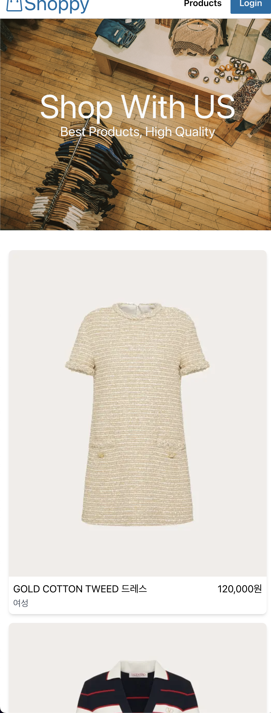
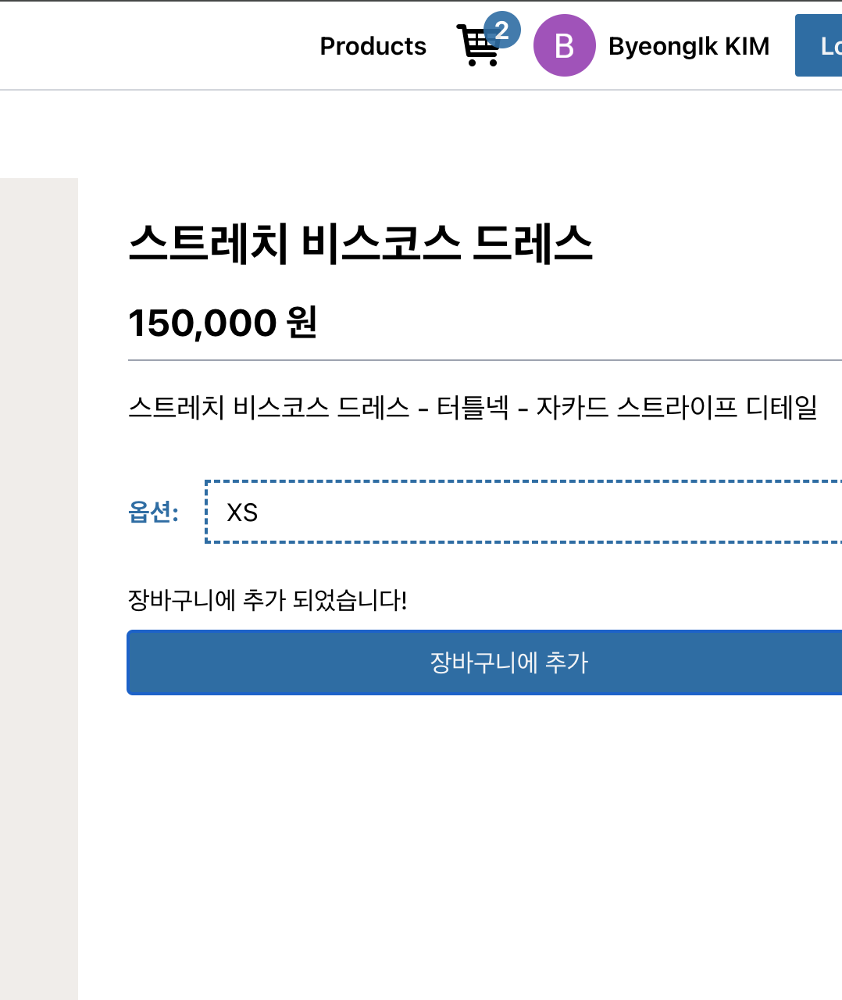
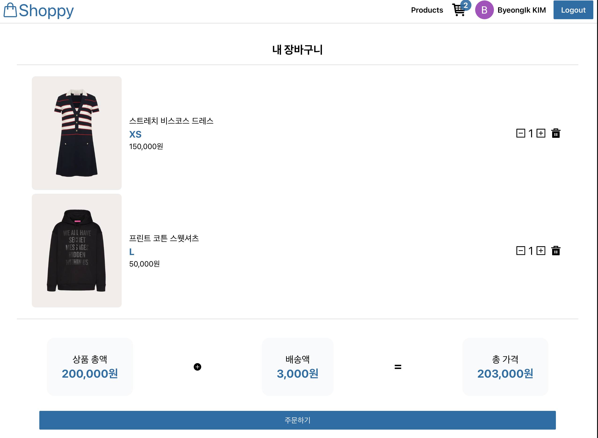
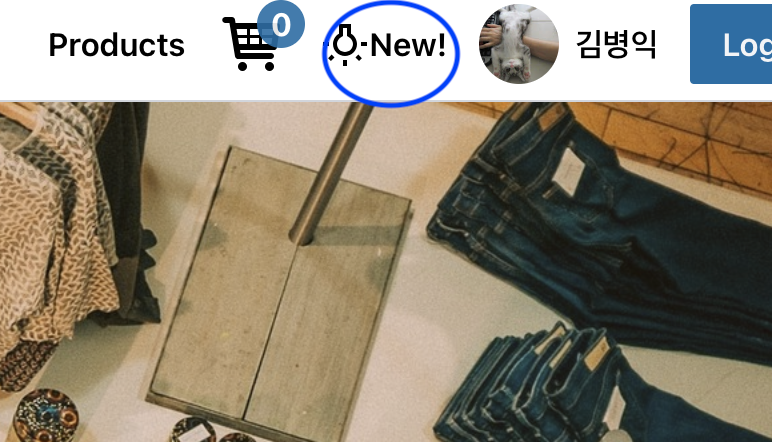
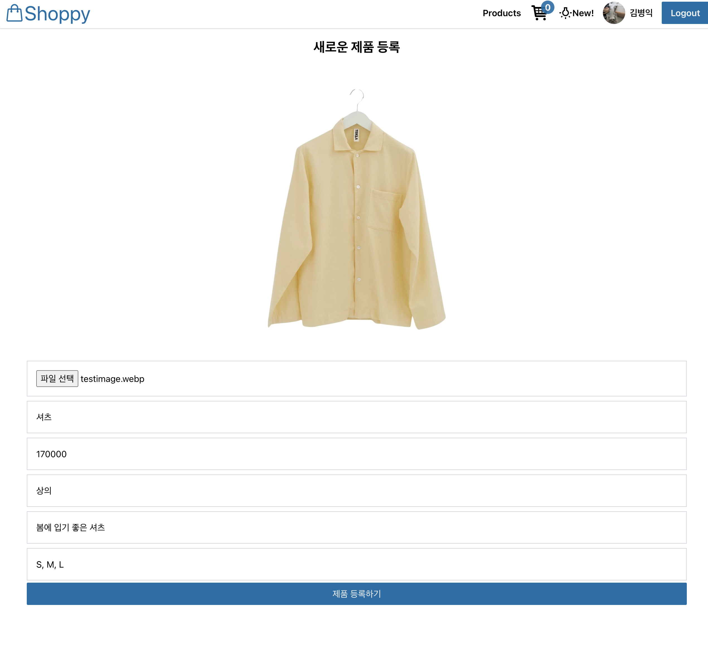
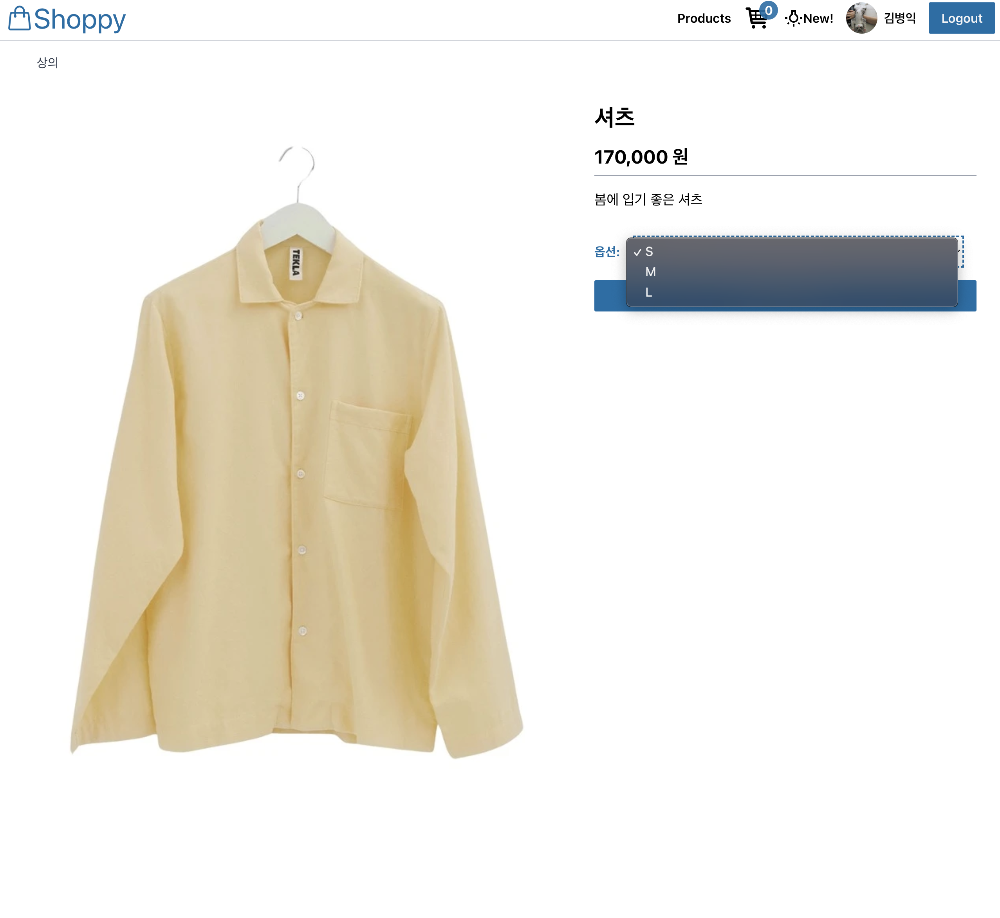

# 🛒 Shoppy 2024

## 📌 소개

**Shoppy 2024**는 Firebase와 Cloudinary를 활용하여 구축된 **온라인 쇼핑몰 웹 애플리케이션**입니다.  
사용자는 상품을 둘러보고 장바구니에 추가할 수 있으며, 관리자(어드민)는 상품을 실시간으로 등록하고 관리할 수 있습니다.

🚀 **배포된 사이트:** [Shoppy 2024](https://shoppy-bk.netlify.app/)

## 📸 **앱 화면 캡처:**

### 🏠 **메인화면 (Web & Mobile)**

<div>
    
  
</div>

---

### 🛒 **장바구니 - 로그인 시 제공**

<div>
  
  
</div>

---

### 🛍️ **신제품 추가 (New!) - Admin 계정 로그인 시 제공**



---

### 🔧 **신제품 추가 방법 및 추가 완료 화면**

<div>
  
  
</div>

## 🔹 주요 기능

### 🏠 메인 페이지

- 네비게이션 바를 통해 주요 기능 이동 및 로그인 가능
- 등록된 제품 리스트를 카드 형식으로 표시
- 상품 클릭 시 상세 페이지로 이동

### 🔍 제품 상세 페이지

- 선택한 제품의 상세 설명, 가격, 사이즈 옵션 제공
- 로그인 시 장바구니 추가 기능 지원

### 🔑 로그인 기능

- **Firebase Authentication**을 활용하여 로그인 구현
- **일반 사용자:** 상품을 장바구니에 추가 가능
- **관리자(어드민):** 상품을 추가 및 관리 가능

### 🛒 장바구니 기능

- 사용자가 선택한 상품을 장바구니에 추가 가능
- 장바구니에서 상품 삭제 가능

### 🛠 관리자 기능

- **제품 추가 페이지**를 통해 상품 추가 가능
  - 제품 사진 업로드 (Cloudinary 활용)
  - 가격 및 사이즈 옵션 설정
  - 제품 설명 입력
- **Firebase Realtime Database**와 연동하여 실시간 제품 등록 가능

---

## 🔹 기술 스택

- **프론트엔드**: React, JavaScript, CSS
- **인증**: Firebase Authentication
- **데이터베이스**: Firebase Realtime Database
- **파일 업로드**: Cloudinary
- **배포**: Netlify ([배포 링크](https://shoppy-bk.netlify.app/))

---

## 🔹 프로젝트 폴더 구조

```
📦src
 ┣ 📂api          # Firebase 및 Cloudinary API 관련 코드
 ┃ ┣ 📜firebase.js
 ┃ ┗ 📜uploader.js
 ┣ 📂components    # UI 및 기능성 컴포넌트
 ┃ ┣ 📂ui
 ┃ ┃ ┗ 📜Button.jsx
 ┃ ┣ 📜Banner.jsx
 ┃ ┣ 📜CartStatus.jsx
 ┃ ┣ 📜Cartitem.jsx
 ┃ ┣ 📜Navbar.jsx
 ┃ ┣ 📜PriceCard.jsx
 ┃ ┣ 📜ProductCard.jsx
 ┃ ┣ 📜Products.jsx
 ┃ ┗ 📜User.jsx
 ┣ 📂context       # 전역 상태 관리 (Auth Context)
 ┃ ┗ 📜AuthContext.jsx
 ┣ 📂hooks         # 커스텀 훅
 ┃ ┣ 📜useCart.jsx
 ┃ ┗ 📜useProducts.jsx
 ┣ 📂pages         # 주요 페이지
 ┃ ┣ 📜AllProducts.jsx
 ┃ ┣ 📜Home.jsx
 ┃ ┣ 📜MyCart.jsx
 ┃ ┣ 📜NewProduct.jsx
 ┃ ┣ 📜NotFound.jsx
 ┃ ┣ 📜ProductDetail.jsx
 ┃ ┗ 📜ProtectedRoute.jsx
 ┣ 📜App.js         # 메인 애플리케이션 컴포넌트
 ┣ 📜index.js       # React 진입점
 ┣ 📜index.css      # 전역 스타일
 ┗ 📜logo.svg       # 로고 이미지
```

---

## 🔹 실행 방법

### 1️⃣ 프로젝트 클론

```sh
git clone https://github.com/your-username/shoppy-2024.git
cd shoppy-2024
```

### 2️⃣ 환경 변수 설정 (`.env.local`)

Firebase 및 Cloudinary 설정이 필요합니다. `.env.local` 파일을 생성하고 다음 내용을 추가하세요.

```env
REACT_APP_FIREBASE_API_KEY=your_firebase_api_key  # Firebase API 키
REACT_APP_FIREBASE_AUTH_DOMAIN=your_firebase_auth_domain  # Firebase 인증 도메인
REACT_APP_FIREBASE_DB_URL=your_firebase_database_url  # Firebase 실시간 데이터베이스 URL
REACT_APP_FIREBASE_PROJECT_ID=your_firebase_project_id  # Firebase 프로젝트 ID
REACT_APP_CLOUDINARY_PRESET=your_cloudinary_preset  # Cloudinary 업로드 프리셋
REACT_APP_CLOUDINARY_URL=your_cloudinary_url  # Cloudinary 업로드 URL
```

### 3️⃣ 의존성 설치 및 실행

```sh
yarn install  # 또는 npm install
yarn start    # 또는 npm start
```

### 4️⃣ 빌드 및 배포

```sh
yarn build
npx serve -s build
```
